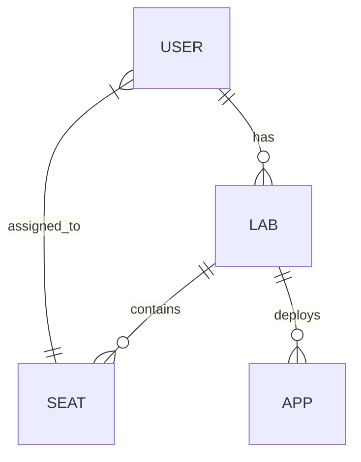

# sandmold

Self: https://github.com/Friends-of-Ricc/sandmold (public)

Create a 🏖️🎲 Sandboxed Playground to run GCP labs in a fire-and-forget Folder

## Owners

* Riccardo `palladius`
* Leonid `minherz`

## Architecture

