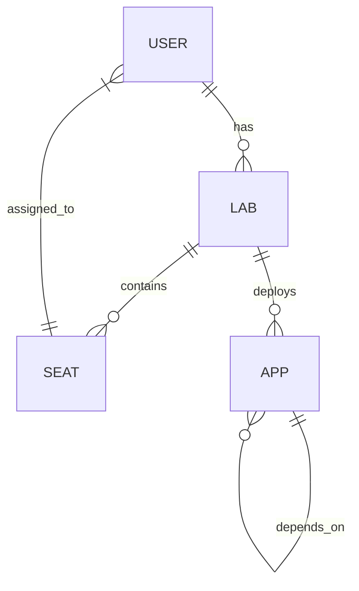

# sandmold

Self: https://github.com/Friends-of-Ricc/sandmold (public)

Create a 🏖️🎲 Sandboxed Playground to run GCP labs in a fire-and-forget Folder.

## Vision

A multi-seat classroom Terraformed from the ground up to Google Cloud to minimize friction for students.

Taxonomy:

* 1 GCP Folder <=> 1 **Classroom**
  * 1 GCP Project <=> 1 **ClassBench**
    * 1+ users per Project (**Seats**)
    * 0+ apps per Project ("Applications"). All the apps of a project constitute its **Curriculum**.
* Every app has a `blueprint.yaml` which defines relationships/dependencies and how to install it (skaffold-like).
    * For instance,

## Supported apps

We intend to support the most popular solutions like:
* **Bank of Anthos** (aka BoA): https://github.com/GoogleCloudPlatform/bank-of-anthos
* **Online Boutique** (aka Heapster Shop): https://github.com/GoogleCloudPlatform/microservices-demo

The idea is that a class teacher can easily build scenario on top of existing blueprints.

Also nice to haves:

* [Cloud Ops sandbox](https://github.com/GoogleCloudPlatform/cloud-ops-sandbox) - maybe
* Jumpstart solutions [announcement](https://cloud.google.com/blog/products/application-modernization/introducing-google-cloud-jump-start-solutions) - :
  * AI/ML image processing on Cloud Functions [TF@GH](https://github.com/GoogleCloudPlatform/terraform-ml-image-annotation-gcf/tree/sic-jss/infra) - [delete](https://cloud.google.com/architecture/ai-ml/image-processing-cloud-functions?_gl=1*18ivjg4*_ga*MTU4NDM3ODU4My4xNzUxMzU5MDE2*_ga_WH2QY8WWF5*czE3NTEzNjQ0NzAkbzIkZzEkdDE3NTEzNjQ0NzMkajU3JGwwJGgw) seems deprecated.
  * Three-tier web application [GH](https://github.com/GoogleCloudPlatform/terraform-google-three-tier-web-app/tree/sic-jss-3) - [Guide](https://cloud.google.com/architecture/application-development/three-tier-web-app?_gl=1*1vwq5ks*_ga*MTU4NDM3ODU4My4xNzUxMzU5MDE2*_ga_WH2QY8WWF5*czE3NTEzNjQ0NzAkbzIkZzEkdDE3NTEzNjQ2MTgkajEyJGwwJGgw)

## Goals

* Enable Operators to do Ops scenarios on GCP.
* Leverage  App Hub to list/host applications.
* Create a shared Ops environment (multi-project monitoring, if needed, Cost monitoring, Logs sync, ..)

## Non-goals for 1.0

* Networking is not in scope for `v1.0`. For the moment, projects are disconnected. More will come.
* `IAM`. For the moment, classroom users will be given a sample `all/Editor` role, if not owner. More granular IAM will come after 1.0.

## Owners

* Riccardo `palladius`
* Leonid `minherz`

Contributing: see `CONTRIBUTING.md`

## Architecture

## Implementation

Check `IMPLEMENTATION.md` for current state of implementation.
_[X] Creation of folder-based
