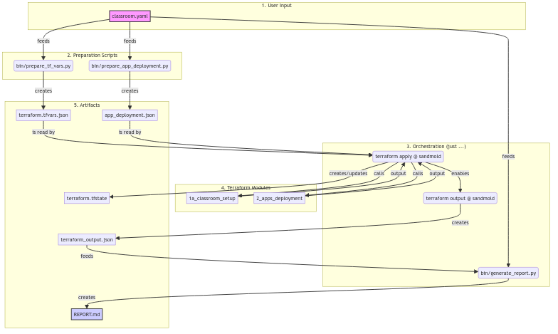

# sandmold

Self: https://github.com/Friends-of-Ricc/sandmold (public)

Create a 🏖️🎲 Sandboxed Playground to run GCP labs in a fire-and-forget Folder.

## Vision

A multi-seat classroom Terraformed from the ground up to Google Cloud to minimize friction for students.

Taxonomy:

* 1 GCP Folder <=> 1 **Classroom**
  * 1 GCP Project <=> 1 **ClassBench**
    * 1+ users per Project (**Seats**)
    * 0+ apps per Project ("Applications"). All the apps of a project constitute its **Curriculum**.
* Every app has a `blueprint.yaml` which defines relationships/dependencies and how to install it (skaffold-like).
    * For instance,

Sample app:


```
$ just classroom-inspect-sampleclass
[...]
🌳 Exploring parent folder (1000371719973) in Org: 791852209422 (sredemo.dev)
├── 📁 test-sandmold-1 (194703823593)
│   └── 📁 ng1-class-with-apps-rgf8 (114577106522)
│       ├── 🧩 ng1-std-failing-foobar-ro5m (ng1-std-failing-foobar-ro5m)
│       ├── 🧩 ng1-std-foobar01-vsb5 (ng1-std-foobar01-vsb5)
│       ├── 🧩 ng1-std-p3-v7km (ng1-std-p3-v7km)
│       └── 🧩 ng1-tch-teacherz-lvs6 (ng1-tch-teacherz-lvs6)
```
## Supported apps

We intend to support the most popular solutions like:
* **Bank of Anthos** (aka BoA): https://github.com/GoogleCloudPlatform/bank-of-anthos
* **Online Boutique** (aka Heapster Shop): https://github.com/GoogleCloudPlatform/microservices-demo

The idea is that a class teacher can easily build scenario on top of existing blueprints.

Also nice to haves:

* [Cloud Ops sandbox](https://github.com/GoogleCloudPlatform/cloud-ops-sandbox) - maybe
* Jumpstart solutions [announcement](https://cloud.google.com/blog/products/application-modernization/introducing-google-cloud-jump-start-solutions) - :
  * AI/ML image processing on Cloud Functions [TF@GH](https://github.com/GoogleCloudPlatform/terraform-ml-image-annotation-gcf/tree/sic-jss/infra) - [delete](https://cloud.google.com/architecture/ai-ml/image-processing-cloud-functions?_gl=1*18ivjg4*_ga*MTU4NDM3ODU4My4xNzUxMzU5MDE2*_ga_WH2QY8WWF5*czE3NTEzNjQ0NzAkbzIkZzEkdDE3NTEzNjQ0NzMkajU3JGwwJGgw) seems deprecated.
  * Three-tier web application [GH](https://github.com/GoogleCloudPlatform/terraform-google-three-tier-web-app/tree/sic-jss-3) - [Guide](https://cloud.google.com/architecture/application-development/three-tier-web-app?_gl=1*1vwq5ks*_ga*MTU4NDM3ODU4My4xNzUxMzU5MDE2*_ga_WH2QY8WWF5*czE3NTEzNjQ0NzAkbzIkZzEkdDE3NTEzNjQ2MTgkajEyJGwwJGgw)

## Getting started

**Prerequisites**. To get started, you need:

* A working Billing Account ID.
* An existing Cloud Organization and a Folder inside it.
* The `gcloud` CLI installed.
* [Optional] The `just` CLI installed ([download](https://github.com/casey/just)). Alternatively, you can just read the recipes in `justfile`, they mostly are convenience wrappers around commands in `bin/`.

Needed actions:

* 1\. **Clone the repository:**
  * `git clone git@github.com:Friends-of-Ricc/sandmold.git`
  * `cd sandmold`
* 2\. **Configure your environment:**
  * `cp .env.dist .env`
  * Edit the `.env` file and fill in the required values for `BILLING_ACCOUNT_ID`, `ORGANIZATION_ID`, `PARENT_FOLDER_ID`, and `GCLOUD_IDENTITY`.
* 3\. **Authenticate with Google Cloud:**
  * Run `just auth`. This will authenticate both you (as a user) and the application (via Application Default Credentials).
* 4\. **Verify your setup:**
  * Run `just check-setup` to ensure all your configurations are correct.
  * For a more thorough check, run `just check-setup-with-project-creation`. This will create and delete a test project to verify your permissions.
* 5\. **Deploy a classroom:**
  * `just classroom-up etc/samples/classroom/2teachers_4realstudents.yaml`

To troubleshoot:

* For a complete list of available commands and their descriptions, see the [`justfile`](./justfile).

## Goals

* Enable Operators to do Ops scenarios on GCP.
* Leverage  App Hub to list/host applications.
* Create a shared Ops environment (multi-project monitoring, if needed, Cost monitoring, Logs sync, ..)

## Non-goals for 1.0

* Networking is not in scope for `v1.0`. For the moment, projects are disconnected. More will come.
* `IAM`. For the moment, classroom users will be given a sample `all/Editor` role, if not owner. More granular IAM will come after 1.0.

## Owners

* Riccardo `palladius`
* Leonid `minherz`

Contributing: see `CONTRIBUTING.md`

## Architecture


## Data Flow

This diagram shows the data flow from the initial YAML configuration to the final report.



## Terraform Structure

The core logic of Sandmold is built upon a modular Terraform structure. This design separates infrastructure provisioning from application deployment, providing flexibility for different use cases. For a detailed explanation of the Terraform modules and their interactions, please see the [Terraform Modules Overview](doc/TERRAFORM_MODULES.md).

## Implementation

Check `IMPLEMENTATION.md` for current state of implementation.
_[X] Creation of folder-based

## Single User Setup

For a more lightweight, cost-effective setup for a single user, you can use the `just user-up` command. This will create a single project with the necessary APIs and permissions for the labs.

1.  **Create a YAML configuration file.** You can use `etc/samples/single_user/light.yaml` as a starting point.
2.  **Run the `just` command:**
    ```bash
    just user-up [path/to/your/user.yaml]
    ```
    If you don't provide a path to a YAML file, it will default to `etc/samples/single_user/light.yaml`.

## Testing

You can test the YAML quality with `just test-yaml YOUR_CONFIG.yaml`.

You can also do more interesting preflight checks like:


