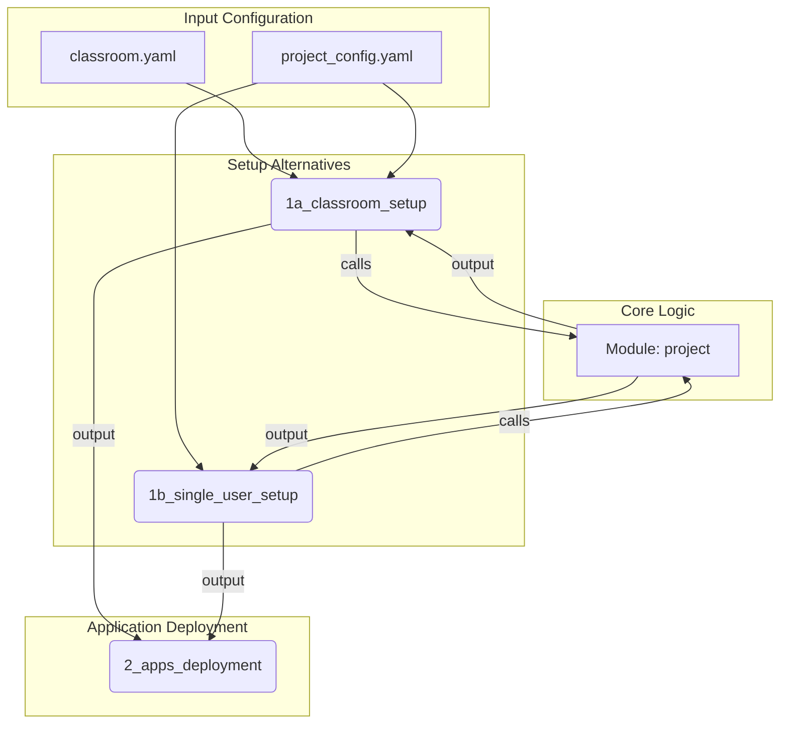

# Terraform Interface Contracts

This document defines the input/output contracts for the Terraform modules and configurations within this project. A clear interface is crucial for ensuring modularity, reusability, and maintainability.

## Workflow Diagram

---

## 1. Core Module: `modules/project`

This is the reusable component for creating or sourcing a single GCP project.

### Inputs

| Name                 | Type                          | Description                                                                                                             | Default     |
| -------------------- | ----------------------------- | ----------------------------------------------------------------------------------------------------------------------- | ----------- |
| `create_project`     | `bool`                        | If `true`, create a new project. If `false`, use a data source to look up an existing project by `project_id`.             | `true`      |
| `project_id`         | `string`                      | The desired project ID. A random suffix is appended if `create_project` is true.                                        | **Required**|
| `billing_account_id` | `string`                      | The billing account to link to the project.                                                                             | **Required**|
| `parent`             | `string`                      | The resource to create the project under (e.g., `folders/12345` or `organizations/67890`).                               | **Required**|
| `services_to_enable` | `list(string)`                | A list of APIs to enable (e.g., `run.googleapis.com`).                                                                  | `[]`        |
| `iam_permissions`    | `map(list(string))`           | A map where keys are roles (e.g., `roles/run.admin`) and values are lists of members (e.g., `["user:student1@gmail.com"]`). | `{}`        |

### Outputs

| Name             | Type     | Description                                                    |
| ---------------- | -------- | -------------------------------------------------------------- |
| `project_id`     | `string` | The final, actual ID of the created or sourced project.        |
| `project_number` | `string` | The unique, numeric identifier for the project.                |

---

## 2. Configurations

### `1a_classroom_setup` (CUJ001)

Orchestrates the creation of a folder and multiple projects.

*   **Inputs**: Consumes variables generated by `bin/generate_tf_vars.py` from `classroom.yaml` and `project_config.yaml`.
*   **Outputs**: A `projects` map that is structurally compatible with the `2_apps_deployment` stage.

### `1b_single_user_setup` (CUJ002)

A lean configuration for a single user to create one project.

*   **Inputs**: Takes simple variables from a user-created `terraform.tfvars` file.
*   **Outputs**: A `projects` map that is structurally identical to the classroom output, ensuring pluggability with `2_apps_deployment`.

### `2_apps_deployment`

Deploys applications to the projects created in the preceding stage.

*   **Inputs**: A `projects` map from either `1a_classroom_setup` or `1b_single_user_setup`.
*   **Outputs**: A report of application deployment status.
