---
# this article will go to Medium once finished.
# TF: b/463586009
title: "A GCP Terraform Classroom for hackathons: my personal learning with Gemini CLI"
author: "Riccardo Carlesso"
description: "Riccardo's lessons learned on Terraform, Sandmold and SaaS Runtime."
medium_article_url: "TODO - WIP"
slides: "https://docs.google.com/presentation/d/1JkWncwizk7qUnBfnKCBy-wnHQ5uswtB_U2iThrKsxeU/edit"
---

# A Terraform Classroom for hackathons on GCP: a tale of learnings with Gemini CLI

This summer, I was given the time to do some profound learning on the **Operations** side. My mission? To sharpen my Terraform skills while pair-programming with the Gemini CLI. My project, which I affectionately named "**Sandmold**", was born from a real world customer need: to create a one-click, ephemeral, sandboxed Google Cloud environments for **workshops** and **hackathons** where students have a pre-constructed environment to run certain exercise and the teacher(s) can observe students and check their progress. At the end of the day, a `tf destroy` ensure you won't break the bank (unless its the [Bank of Anthos](https://github.com/GoogleCloudPlatform/bank-of-anthos)).

<!-- [GCP and Terraform classroom](images/page1_img5.jpeg) -->
test 1 no BOA

test 2 with BOA but uglier

TODO choose one.

<!-- God I love Gemini CLI + Nanobanana Pro! 

Prompt:

Now take image images/page1_img5.jpeg . I'd like to use Nanobanana Pro MCP to create a classroom where it seems like the whole
  cflassroom was created via Terraform, using some image tricks like transparency, watercolors, I dont know! Something where class,
  workbench, apps they all popup like boxes/parallelepipeds half-transparent from a Terraform pandora's box or Aladdin's lamp,
  whichever metaphor you want to convey. It should showcase that this is easy to create and dispose with one click, and the delta
  between the terraformed class and the EMPTY class should be evident to the viewer. Makes sense?

-->

The idea is simple: **pre-provision a class for N students who (alone or in pairs) can solve a generic exercise in a sandboxed environment. Here, teachers would have automatic observability over people**.

### What is this article about? Terraform? Cloud? Errors

This article is a mixture of things: it's me following a dream, finding it was broken all along, and sharing my learnings on it; while at it, I'm sharing some cool technologies that Operators in the room might find interesting (together with the learnings).

This article describes my "Terraforming a Classroom" journey, and how AI helped it (or killed it?).

The multi-stage architecture was strongly inspired by Luca's [GenAI Factory](https://github.com/GoogleCloudPlatform/genai-factory). I loved in particular how you get the output from stage1 to build the `TFVAR`s of stage2 (magic line [here](https://github.com/GoogleCloudPlatform/genai-factory/blob/master/cloud-run-single/0-projects/outputs.tf#L73))!

<!-- this is for a 
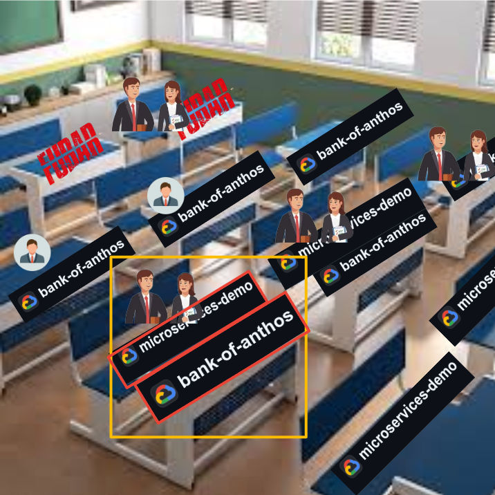
-->

## Sandmold? Why this horrible name?

 Well, take a person who is thinking in 🇮🇹 Italian, querying Google Images in a 🇩🇪 German speaking region, and then Google translating from German shopping sites to 🇬🇧 English, finally double-checking with a 🇷🇺 Russian colleague. There you have it: "formine per sabbia" -> "Gill Förmchen" > "Sandmold" > "Da". Once my American colleagues came for the rescue, the repo was registered, [go links](https://golinks.github.io/golinks/) already created, and there was no going back.

## What's a Classroom?

The ClassRoom analogy is simple:

Option 1 via gemini.google.com - breathtaking:

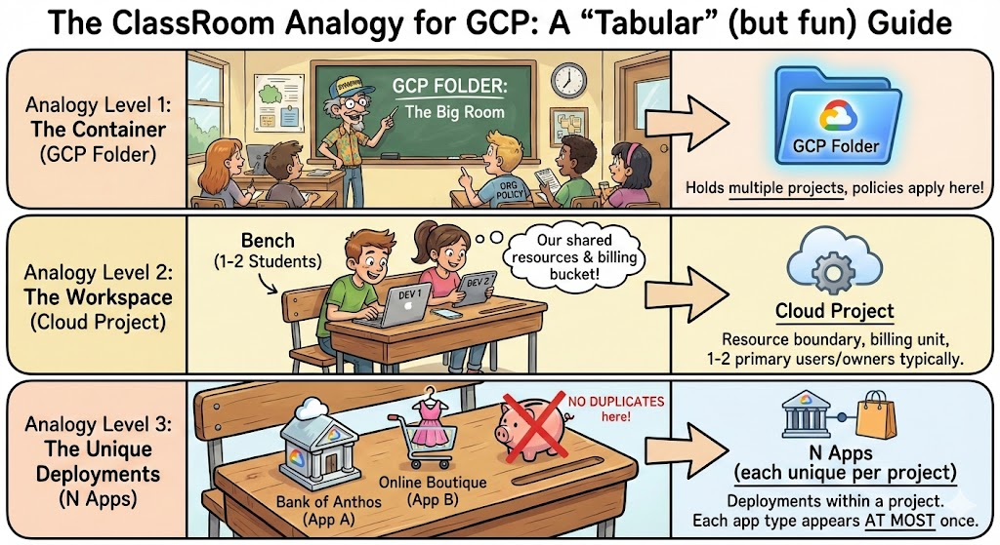

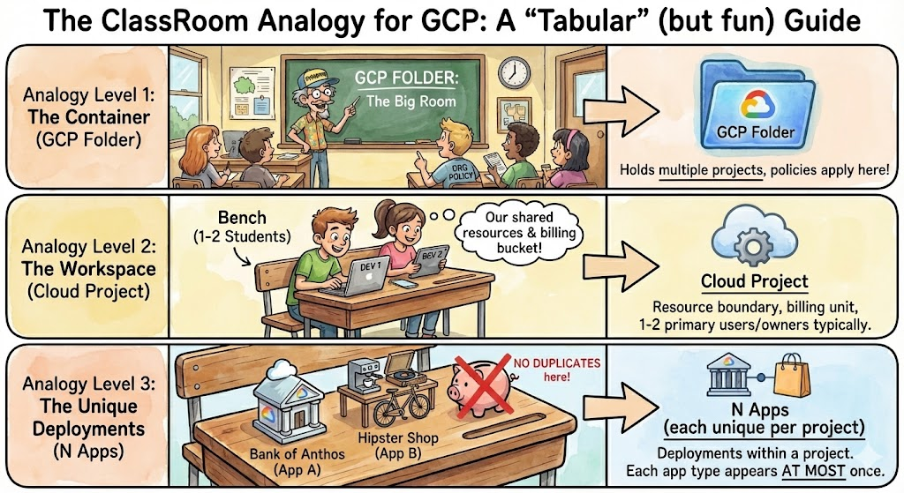

Option 2 via MCP - which is best?

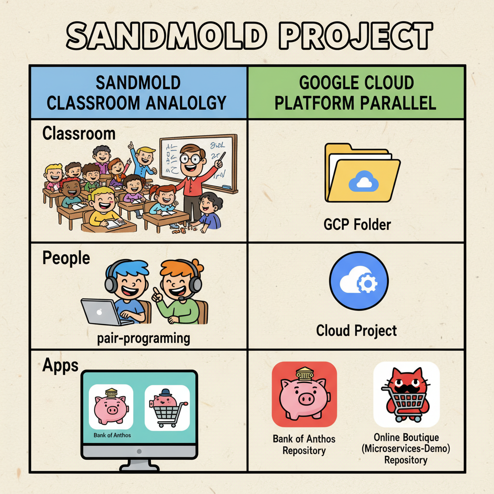

* A **classroom** corresponds to a [GCP Folder](https://docs.cloud.google.com/resource-manager/docs/creating-managing-folders).
* A **bench** is a [Cloud Project](https://developers.google.com/workspace/guides/create-project) (usually, 1-2 students per bench).
* A project can have N **apps**, each appearing at most once (eg, one [Bank of Anthos](https://github.com/GoogleCloudPlatform/bank-of-anthos) and one [Online Boutique](https://github.com/GoogleCloudPlatform/microservices-demo), but *not* two [Banks of Anthos](https://github.com/GoogleCloudPlatform/bank-of-anthos)).

## The Vision: from YAML to a working Playground

As a Rubyist, I love YAMLs. This is the promise of my project (and it delivers!):

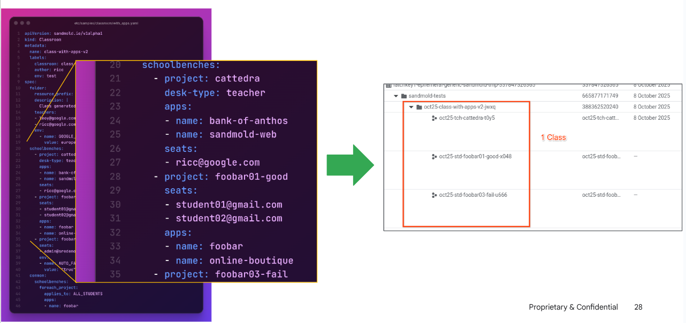

And to do so, you *just* (literally) run a `just` script which calls terraform and creates a Markdown file with the results (`REPORT.md`):

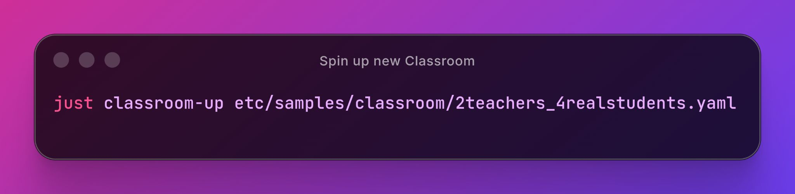

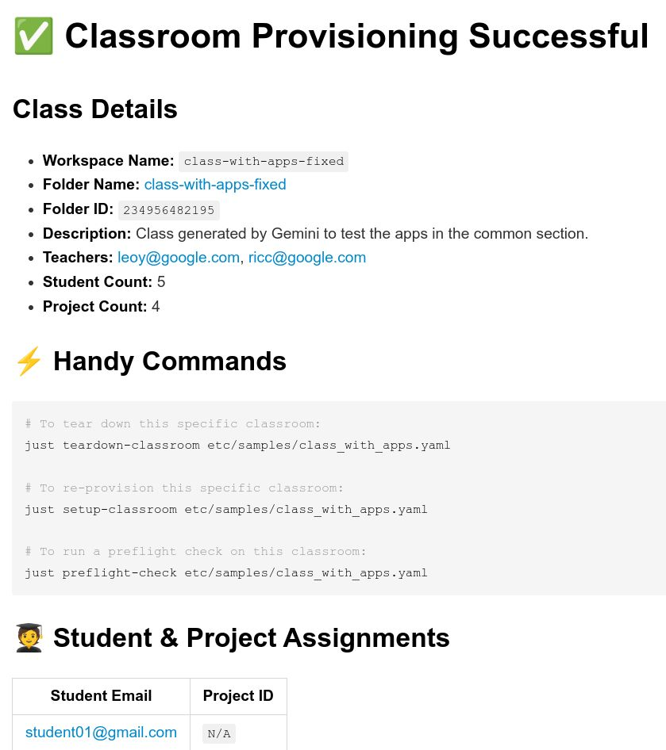  Which creates, after some terraforming, a clean `output.tf`:

Note that a succesfully destroyed classroom *also* leaves a report.md with a link to the destroyed resources.

<!-- 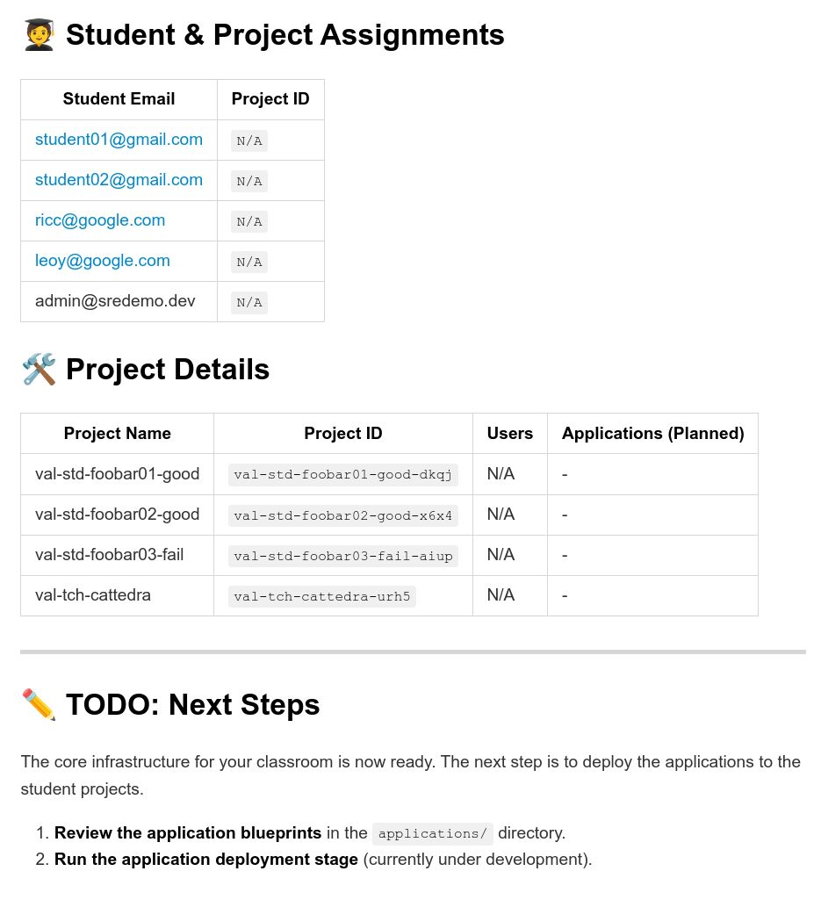 -->

## The Vision: A Cloud Playground with SaaS Offerings

My vision for Sandmold was to create a modular, open-source playground, easily spinning up complex environments like Online Boutique or Bank of Anthos as self-contained "SaaS" offerings. This would allow teachers to provision entire classrooms and personal labs for students with simple commands. 

After a talk with my Terraform expert Roberto, this pursuit naturally led me to Google Cloud's [SaaS Runtime](https://cloud.google.com/products/saas-runtime) — a powerful, yet new, product for multi-tenant SaaS. 
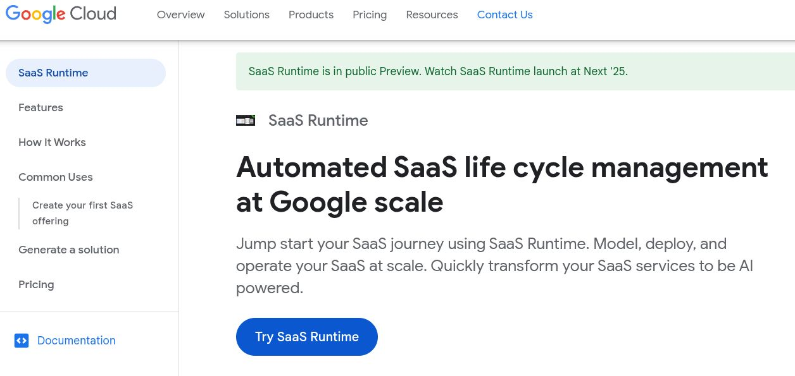

It seemed perfect, but as with any new frontier, there were **beasts** to slay first!

## Part 1: Terraform and Gemini CLI

[Gemini CLI](https://github.com/google-gemini/gemini-cli) was invaluable throughout this project. I was incredibly lucky to have Gemini CLI write the Terraform code for me, and to quickly rectify mistakes through its iterative process with `terraform plan` and `terraform apply`. It was beautiful to see it iterate through mistakes (sometimes very narrow and arcane), fixing them, retrying and getting them fixed. 
Given that Terraform needs to check resources to exist in the cloud, this feedback loop would be slow at times, sometimes taking up to 15min, but I would have  lunch, or simply I could check emails or do meetings, while Gemini CLI was meticulously trying to fix my code.

## My Journey into the SaaS Runtime Rabbit Hole

[SaaS Runtime](https://cloud.google.com/products/saas-runtime) has its own vocabulary and a specific order of operations. Think of it like making a proper Italian dinner: you can't just throw everything in the pot at once! You have the *antipasto*, the *primo*, the *secondo*. It's a process.

Here are the key concepts I had to wrap my head around:

 

*   **SaaS Offering:** This is the big picture, the entire dish. It represents your SaaS product, like "Bank of Anthos as a Service"
*   **Unit Kind:** This is a specific component of your offering, like the "GKE cluster" or the "PostgreS database". It's an ingredient in your recipe. More importantly, it can *evolve*.
*   **Release:** A specific, versioned snapshot of your Unit Kind. Think of it as a specific version of your food recipe (eg, lasagne).
*   **Unit:** An actual, running instance of a Unit Kind. If Unit Kind is the Java class, this is the Java instance; if Unit Kind is a dish on the menu, the Unit is the actual Lasagna which they serve on your table, different from other Lasagnas, but taken from the same baking tray. More importantly, different restaurants (tennants) could run different version of the same menu / lasagna; or in the same restaurant you could A/B test a new recipe with just a very few loyal customers...

[This E/R Diagram](https://github.com/Friends-of-Ricc/sandmold/blob/main/iac/saas-runtime/ER_DIAGRAM.md) (and the figure on the side) explains it in some more details.

Understanding this hierarchy, along with these entities cross-dependencies, were the most crucial lesson of my journey. Now, let's get our hands dirty and see how these concepts translate into actual code.

## Our First SaaS in Terraform folders

My first test was a standard, no-frills Terraform setup:

* [iac/saas-runtime/terraform-modules/terraform-vm](https://github.com/Friends-of-Ricc/sandmold/tree/main/iac/saas-runtime/terraform-modules/terraform-vm). This is a simple VM on GCP. `variables.tf`, `main.tf`, `outputs.tf`: the usual sauce. The important part was to set up the `tenant_project_id` variable, which gets populated with the project where the instance actually lives.

In the language of SaaS Runtime, this humble Terraform module is our **Blueprint**. We package it up (as we'll see later, this had its own set of adventures) and use it to define a **Unit Kind** called `simple-vm`. When we want to create an actual VM, we provision a **Unit** of this kind.

With this simple foundation in place, I was ready to move on to the more complex and exciting offerings: Bank of Anthos and Online Boutique.

First thing, I tried to create a **Classroom** (Folder) in [iac/saas-runtime/terraform-modules/terraform-classroom-folder](https://github.com/Friends-of-Ricc/sandmold/tree/main/iac/saas-runtime/terraform-modules/terraform-classroom-folder).

I hit a few roadblocks, so I parked this to make a working `bash` script instead. 

Meanwhile, I kept taking screenshot and noting error messages in a **Friction Log**. Friction Logs are something we do in Google, where a user tracks the frustration of a certain User Experience in a Google Doc, as actionable feedback (I encountered X while I was expecting Y) and shares with Product Owners who can take action. So my errors weren't lost on the product!

## The script solution

It took me nearly two weeks to create a working, reentrant SaaS definition. I'm very proud of this folder: [iac/saas-runtime/bin/](https://github.com/Friends-of-Ricc/sandmold/tree/main/iac/saas-runtime/bin). These scripts allow you to:

1. [01-create-saas.sh](https://github.com/Friends-of-Ricc/sandmold/blob/main/iac/saas-runtime/bin/01-create-saas.sh)  Create a SaaS Runtime
2. [02-create-unit-kind.sh](https://github.com/Friends-of-Ricc/sandmold/blob/main/iac/saas-runtime/bin/02-create-unit-kind.sh) Create a Unit Kind.
3. [03-build-and-push-blueprint.sh](https://github.com/Friends-of-Ricc/sandmold/blob/main/iac/saas-runtime/bin/03-build-and-push-blueprint.sh) Build a Blueprint given a TF module dir, and push it. This was a very hard part.
4. [04-create-release.sh](https://github.com/Friends-of-Ricc/sandmold/blob/main/iac/saas-runtime/bin/04-create-release.sh) Create a first release, say "1.0". [04a-reposition-uk-default.sh](https://github.com/Friends-of-Ricc/sandmold/blob/main/iac/saas-runtime/bin/04a-reposition-uk-default.sh) is needed to tell the UK that the default release is "1.0". This changes the state of the UK and from now on every deployed Unit will have that version. 
5. [05-create-unit.sh](https://github.com/Friends-of-Ricc/sandmold/blob/main/iac/saas-runtime/bin/05-create-unit.sh) Create a Unit based on that UK frozen at that version.
6. [06-provision-unit.sh](https://github.com/Friends-of-Ricc/sandmold/blob/main/iac/saas-runtime/bin/06-provision-unit.sh) Just because you have a lasagna in your oven it doesn't mean your customer have it on the table! You need to serve it, and provision in the right `TENANT_PROJECT_ID`, in a specified `LOCATION` with a proper Service Account for actuation!
7. (optional) [07-create-rollout.sh](https://github.com/Friends-of-Ricc/sandmold/blob/main/iac/saas-runtime/bin/07-create-rollout.sh). This was optional. You can create a RolloutKind and then a rollout instance - in case you want to have an additional templating layer (like we deploy things to Europe in a different way than how we deploy to US).

And how to invoke them all? Two options:

1.  [deploy-sukur.rb](https://github.com/Friends-of-Ricc/sandmold/blob/main/iac/saas-runtime/bin/deploy-sukur.rb), a sophisticated heapster script which creates a shell script. 
2. Or, more simply, `just deploy-saas-end2end`. Code in the [iac/saas-runtime/justfile](https://github.com/Friends-of-Ricc/sandmold/blob/main/iac/saas-runtime/justfile).

Everything is beautifully described in the [README](https://github.com/Friends-of-Ricc/sandmold/tree/main/iac/saas-runtime).

## What went wrong

1. 🚔 **[GCP Org Policies](https://docs.cloud.google.com/resource-manager/docs/organization-policy/overview) are tough** - *really* tough. This makes it very hard to terraform anything across organizations if your organization is well protected (like my Company org). If you're a startup with an unsecured "Landing Zone," you won't feel this pain. However, in a structured organization, a wise Org Admin will likely have locked down your ability to bill projects across organizations.

2. 📁 **Folders are also hard**. While it’s easy to ask people for a `PROJECT_ID`, it's hard to ask people for a `FOLDER_ID`: they need an `ORGANIZATION_ID` and all the 🚔 Org Policy shenanigans kick in. A project can be orgless, a folder cannot. Projects are fungible, folders carry a history and billing constraints.

3. 💛 **Riccardo likes his scripts, others don’t**. Reviewing Friction Logs from two colleagues, I realized what works for me doesn't necessarily work for all. My reliance on scripts like `justfile`, `jq`, `yq`, `lolcat` hindered their code reproductions. A big lesson learned for me: minimize dependencies on external scripts. Rule of thumb: If a script isn't on [Cloud Shell](https://docs.cloud.google.com/shell/docs/launching-cloud-shell), either do without it or document it as an explicit dependency. Yes, `ruby` is in Cloud Shell.. along with `terraform`, `gemini` CLI, `docker`, `gcloud`, `npm` and many others!

## What went well

1. **Gemini CLI is damn GOOD at terraform**! The feedback loop is virtuous: it writes code, tries to execute it, `terraform plan` fails with an actionable syntax error, Gemini CLI corrects it, tries again, .. and so on. If the error is syntactic, Gemini CLI detects and fixes it quickly (short feedback loop). However, architectural errors (IAM permissions, project creation/deletion issues) extend this feedback loop, requiring a response from the Cloud. This is a good time for a merenda.

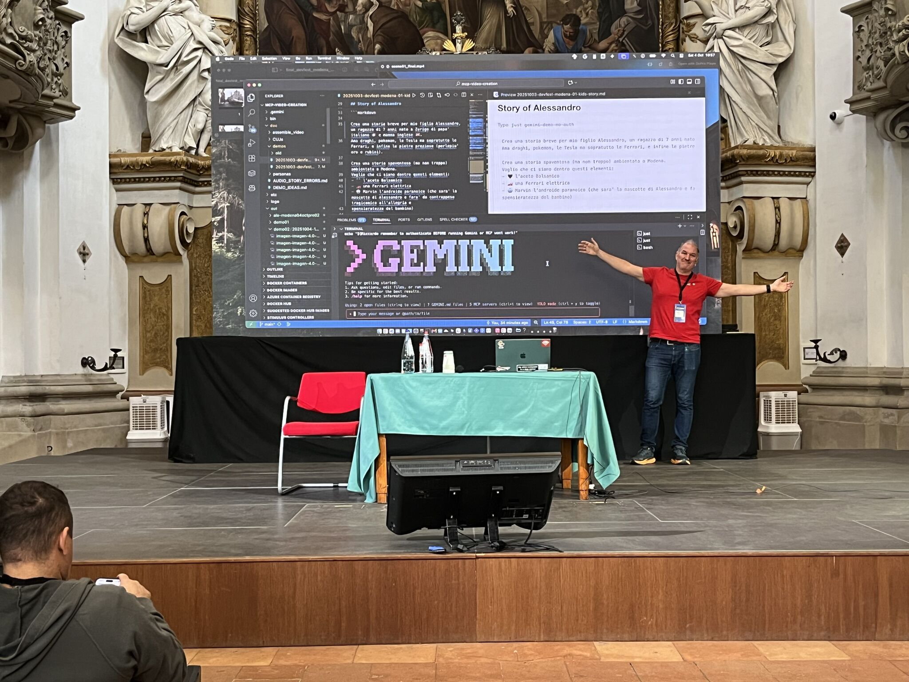

2. Vibecoding setup scripts works really well. So a `bin/check-setup.sh` can yield a friendly:

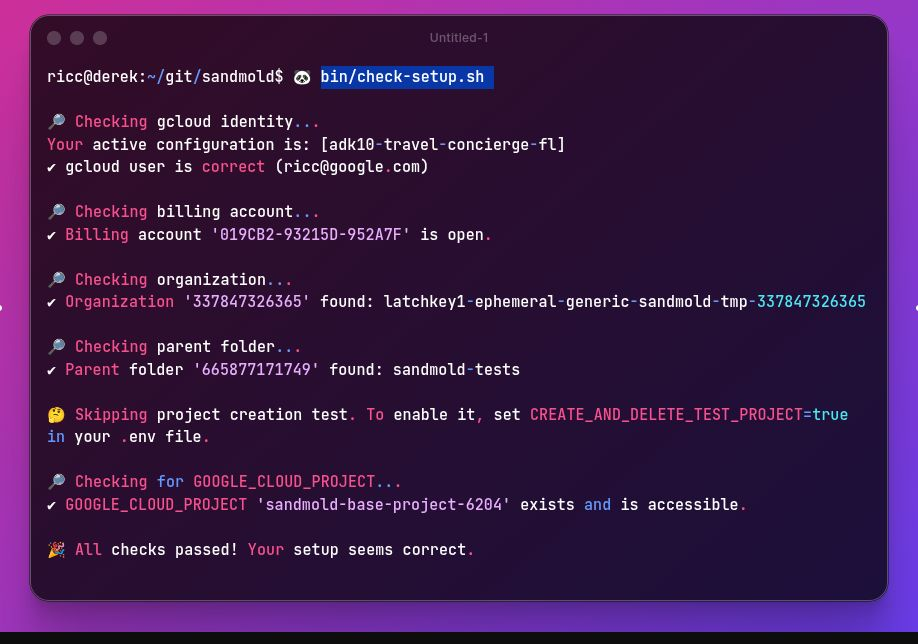

The friendliness of this command got me compliments from multiple colleagues, while I didn't write a line of this... and it's `bash`!

Also look at the [Preflights check script](https://github.com/Friends-of-Ricc/sandmold/blob/main/bin/classroom-inspect.py), in Python, which really shines! The idea is: before executing a lengthy Terraform script, let's ensure the Billing, Project, Folder are set, and let's take a look at what projects are are already in that folder! This gives you color visual feedback while you wait for `terraform` to execute for the next few minutes.

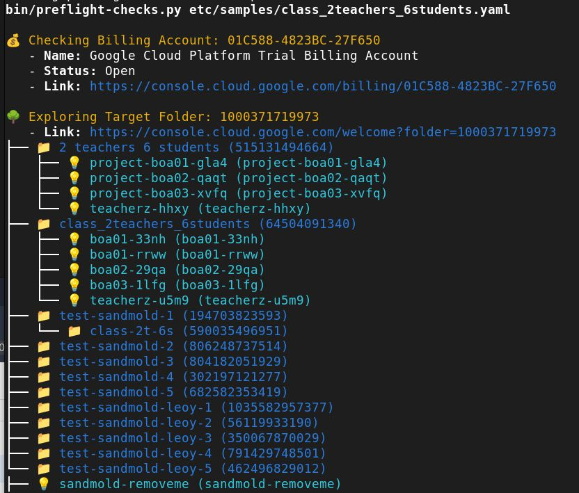

2. **SaaS Runtimes are amazing!**. If you're planning Terraform building blocks with well-defined input/output relationships, and ever-evolving code, Saas runtime will change your life! In a nutshell, this is *Change Management + Terraform at Google scale*! And note: it's used internally at Google by very big teams, so it's battle-tested!

## Conclusions

Vibecoding can be a fun and useful tool to dip your toes in some new technology. This should **not** substitute your own code.

I think we're going to hear more about **Saas Runtimes** in the near future, and if it was stock, I'd bet some money on it.

Finally, if **Gemini CLI** is so great for **terraform**, Operators in the room.. what are you waiting for?!?