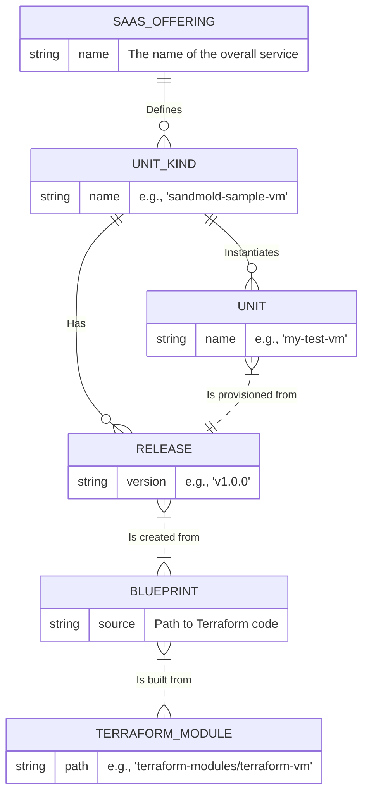

# SaaS Runtime Entity Relationship Diagram

This diagram illustrates the relationships between the core components of the SaaS Runtime.

## Key Entities

*   **SaaS Offering**: The top-level service being offered. It acts as a container for different kinds of units.
*   **Unit Kind (UK)**: Defines a *type* of resource or service that can be provisioned (e.g., a VM, a database, a full application stack).
*   **Release**: A specific, immutable, versioned snapshot of the configuration (the "Blueprint") for a Unit Kind. You deploy a specific release.
*   **Blueprint**: The package containing the Infrastructure-as-Code (IaC) configuration, typically built from a Terraform module. It's the "how-to" guide for creating a resource.
*   **Unit**: An actual, running instance of a Unit Kind, provisioned from a specific Release.
*   **Terraform Module**: The source code (Terraform `.tf` files) that defines the infrastructure to be created.

## Mermaid ER Diagram

## Dependencies

The relationships imply the following dependencies:

*   A **Unit** depends on a **Unit Kind** (to define its type) and a **Release** (to define its versioned configuration).
*   A **Release** depends on a **Unit Kind** (it's a release *of* that kind) and a **Blueprint** (which contains the configuration).
*   A **Blueprint** depends on a **Terraform Module** (the source code).
*   A **Unit Kind** depends on a **SaaS Offering** (its parent container).
