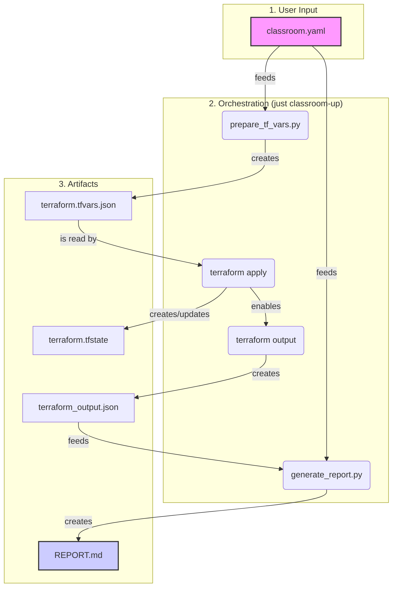

# Sandmold Terraform Infrastructure

This directory contains all the Terraform code for provisioning Google Cloud resources for the Sandmold project.

## How it Works: From YAML to Report

The entire classroom provisioning process is orchestrated by a single command: `just classroom-up <path_to_yaml>`. This command automates a series of steps that transform your high-level YAML definition into live cloud resources and a final summary report.

### Data Flow Diagram

This diagram illustrates how the files are processed and what artifacts are created at each step.

### Step-by-Step Breakdown

1.  **Input: The Classroom YAML (`etc/class_2teachers_6students.yaml`)**
    *   This is the starting point. You define the folder, billing account, projects, users, and applications in this human-readable file.

2.  **Step 1: Generate TFVARS (`bin/prepare_tf_vars.py`)**
    *   The `just` command first calls this Python script.
    *   It reads your classroom YAML and the shared `etc/project_config.yaml`.
    *   It processes this data and creates a new file: `iac/terraform/1a_classroom_setup/terraform.tfvars.json`. This file is a structured variable file that Terraform can understand.

3.  **Step 2: Apply Terraform (`terraform apply`)**
    *   With the `terraform.tfvars.json` file in place, the `just` command runs `terraform apply` inside the `iac/terraform/1a_classroom_setup/` directory.
    *   Terraform reads the `.tf` files and the `.tfvars.json` file.
    *   It communicates with Google Cloud to create the folder, projects, and IAM permissions as defined.
    *   As it works, Terraform creates and updates a critical file: `iac/terraform/1a_classroom_setup/terraform.tfstate`. This file stores the state of your managed infrastructure. **It is very important and is committed to the repository.**

4.  **Step 3: Extract Outputs (`terraform output -json`)**
    *   After a successful `apply`, the `just` command runs `terraform output -json`.
    *   This command reads the `terraform.tfstate` file and extracts the values of all the `output` variables you defined (like the final project IDs and folder ID).
    *   It saves this information into a new file in the root directory: `terraform_output.json`.

5.  **Step 4: Generate Final Report (`bin/generate_report.py`)**
    *   Finally, the `just` command calls the reporting script.
    *   This script reads two files: the `terraform_output.json` (to know what was created) and the original `classroom.yaml` (to know what was intended).
    *   It combines this information to generate the final, user-friendly `REPORT.md`, complete with project details, user lists, and direct links to the Google Cloud Console.

This automated, multi-stage process ensures that the infrastructure is provisioned consistently and that you always get a clear, accurate report of the results.
